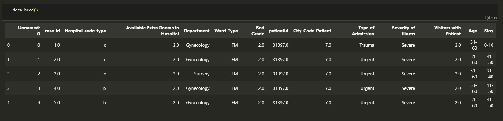
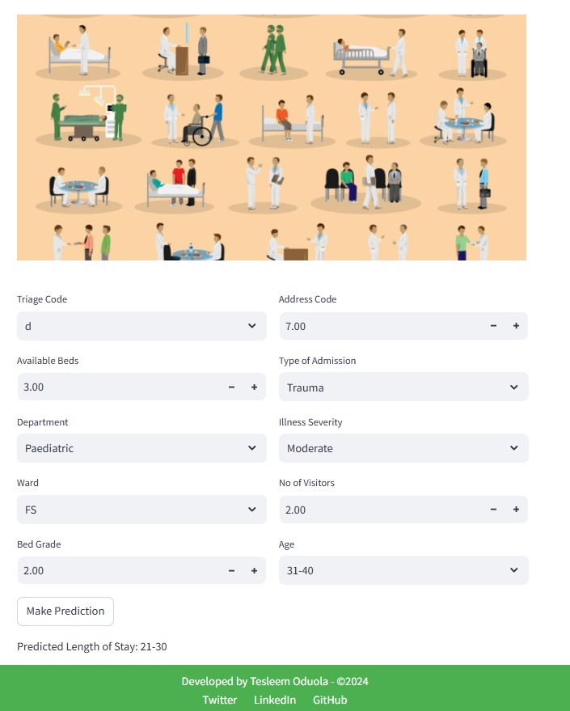

# Predicting Hospital Length of Stay Using Machine Learning

## Table of Contents
- [Project Overview](#project-overview)
- [Dataset Overview](#dataset-overview)
- [Data Preprocessing](#data-preprocessing)
- [Model Building](#model-building)
- [Model Deployment](#model-deployment)

## Project Overview
Diabetes Mellitus is one of the leading cause of morbidity and mortality. This project focuses on building a machine learning model to predict
whether a patient is likely to develop diabetes based on various medical attributes. The goal is to identify patterns that can help in early 
diagnosis and improve patient outcomes.

## Dataset Overview
The data set contains patients' demography with hospital-related features. Attached is screenshot of the data overview.

## Data Preprocessing
Data preprocessing was done to prepare the data for modelling
- **Handle missing values**: Ensured that all missing values in the dataset were properly addressed. No Missing values 
- **Remove duplicates**: Checked for duplicate values to avoid redundancy. No duplicate was found in the dataseta.
- **Scale numerical variables**: The numerical variables in the dataset were scaled to ensure consistent scaling.
- **Encode categorical variables**: Categorical features were encoded 

## Model Building
5 machine learning classifiers:
- Logistic Regression
- Bagging Classifier
- Random Forest Classifier
- Naive Bayes 
- CatBoost Classifier were imported
The classifiers were trained on the training dataset, and evaluated on the test subset of the dataset.

## Model Deployment
The model was deployed using Streamlit

